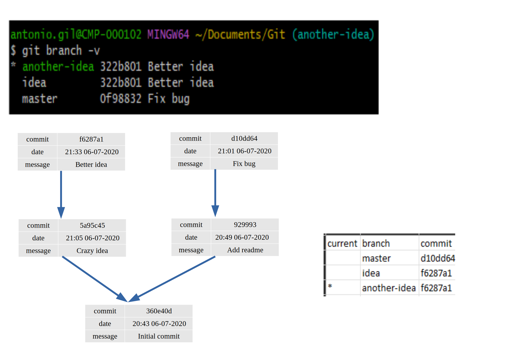
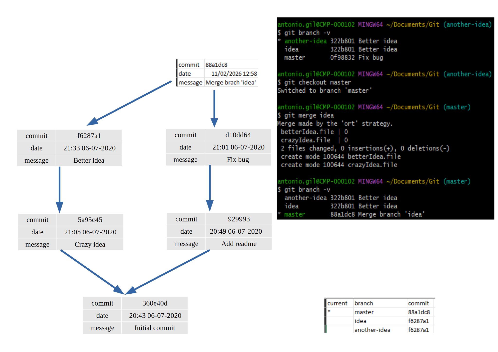
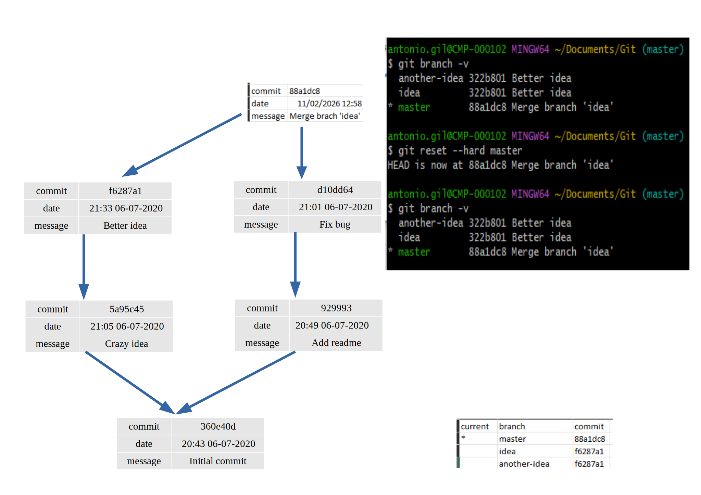

* [Ejercicio](#Ejercicio)
* [Preguntas](#Preguntas)
  * [Preguntas](#Preguntas)
    * [Pregunta 0](#Pregunta-0)
        * [Respuesta 0](#Respuesta-0)
    * [Pregunta 1](#Pregunta-1)
    * [Pregunta 2](#Pregunta-2)
    * [Pregunta 3](#Pregunta-3)

### Ejercicio

Vamos a describir el estado de un repositorio de git de forma simplificada, tiene 2 partes importantes:

* el árbol de commits, que es lo que guarda [la base de datos de snapshots de git](https://git-scm.com/book/en/v2/Getting-Started-What-is-Git%3F) En el diagrama, cada commit apunta a su(s) padre(s).
* la tabla de [branches](https://git-scm.com/book/en/v2/Git-Branching-Branches-in-a-Nutshell), que dice qué branches tenemos y a qué commits apuntan

En un repositorio local, además tenemos:
* el *current branch*, el branch en el cual estamos trabajando en este momento
* el staging area
* el working directory

Hemos empezado a trabajar en un proyecto de git y está en este estado (seguimos la notación de git indicando el current branch con un asterisco). El working tree y el staging area están sin cambios.


### Preguntas:

**Todas las preguntas empiezan con el estado inicial descrito arriba**, no son cambios cumulativos.

Los diagramas son svg así que se pueden editar fácilmente con [inkscape](https://inkscape.org/); hacer un diagrama a mano y subir una foto también es una opción.

#### Pregunta 0

(Ejemplo) Supongamos que hacemos unos cambios y ejecutamos `git commit -m "Better idea"`:

Cambia el diagrama para representar el nuevo estado del repositorio.

##### Respuesta 0

NB: hay que inventarse la fecha y el hash:


#### Pregunta 1

Supongamos que tenemos otra idea, así que hacemos otro branch en este punto y cambiamos a este branch:
```
git branch another-idea
git checkout another-idea
```

Cambia el diagrama para representar el nuevo estado del repositorio: tanto el grafo de commits como la tabla de branches pueden cambiar.
**RESPUESTA**


**Se crearía una nueva rama desde el mismo commit en el que se encuentra idea, pero no se crearía un commit nuevo**
#### Pregunta 2

Supongamos que hemos decidido integrar los cambios de la rama `idea` a `master`, así que cambiamos de rama y ejecutamos un merge:

```
git checkout master
git merge idea
```

Cambia el diagrama para representar el nuevo estado del repositorio: tanto el grafo de commits como la tabla de branches pueden cambiar.

**RESPUESTA**

**En este caso si se crearía un commit nuevo, que partiría de los puntos en los que se encontraran "idea" y "master", y la rama master avanzaría hasta este nuevo commit.
Las ramas "idea" y "another-idea" se mantendrán tal y como estaban**

#### Pregunta 3

Nos hemos bebido un par de botellas de vino y ejecutamos

```
git reset --hard master
```

Cambia el diagrama para representar el nuevo estado del repositorio: tanto el grafo de commits como la tabla de branches pueden cambiar.
**RESPUESTA**

**En este caso particular, tal y como se describe el orden de comandos en el ejercicio, no pasaría nada.**
Explicación:
Como justo antes hemos hecho un "checkout master" reset nos esta moviendo a donde ya estabamos. Sin cambios en este aspecto.
`--hard` sobreescribiría nuestro directorio para ser tal y como era en el ultimo commit de master, así que en principio no pasa nada.
Si tuvieramos archivos sin commit, por ejemplo, si que los perderíamos, así que el daño depende de cuanto hemos escrito mientras nos bebemos las botellas de vino.
Otro ejemplo peligroso es algo como `git reset --hard HEAD~1`, que nos mandaría un commit al pasado, en este caso antes del merge. (y aun asi podriamos rescatar algo mirando con `git reflog`)


Marta was here4
Jon Ander was here2
